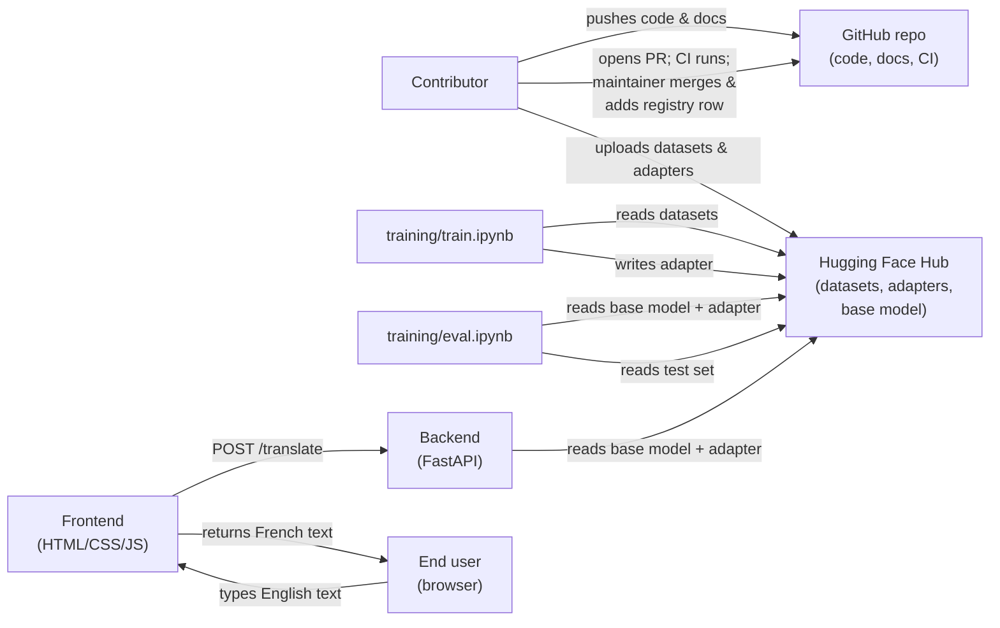
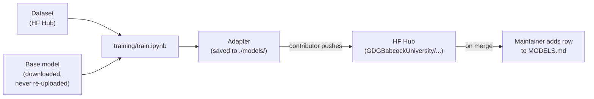
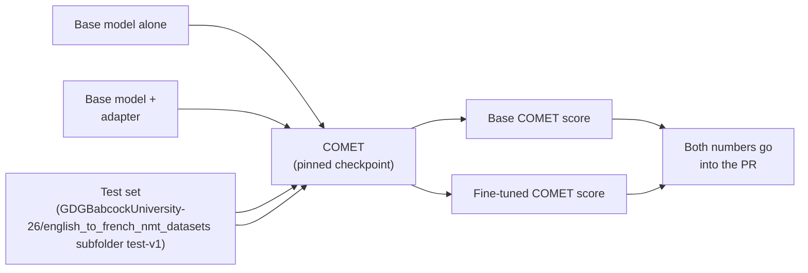
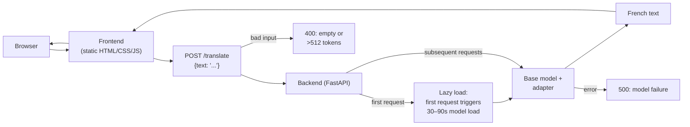

# Architecture

This document describes how the parts of this project fit together. It is aimed at contributors who have never worked on the project before. If a word is unfamiliar, it is defined at first use.

An **adapter** is a small set of extra weights (produced by LoRA or QLoRA fine-tuning) that sits on top of a base model and changes its behavior. On its own it does nothing — it must be loaded on top of the base model to produce translations. See [MODELS.md](../MODELS.md) for a full explanation.

The base model for this project is fixed: `facebook/nllb-200-distilled-1.3B`. It is set once in [`backend/config.py`](../backend/config.py) and never changes.

---

## 1. System overview

This is the whole system. Nothing else exists. Code and documentation live on GitHub. Datasets, adapters, and the base model live on the Hugging Face Hub under the [`GDGBabcockUniversity`](https://huggingface.co/GDGBabcockUniversity-26) organization (except the base model, which lives under `facebook/`). The split is deliberate: code is small and reviewable in a pull request; artifacts are large and versioned separately on HF.

---

## 2. Training pipeline

A training run consumes one approved dataset (listed in [DATASETS.md](../DATASETS.md)). Settings (dataset, adapter name, hyperparameters) are configured in the settings cell at the top of the notebook. The notebook produces one adapter, saved locally to `./models/`. The contributor then pushes that adapter to the Hugging Face Hub. The base model is downloaded during training but is never modified and never re-uploaded. This is what makes adapters swappable: every adapter targets the same fixed base model, so the backend can load any of them.

---

## 3. Evaluation pipeline

The comparison only means something if both sides use the same test set (`GDGBabcockUniversity-26/english_to_french_nmt_datasets subfolder test-v1`, frozen after registration) and the same pinned COMET checkpoint (set in `training/eval.ipynb`). The evaluation notebook produces two numbers: one for the base model alone and one for the base model plus the adapter. Both numbers travel together into the PR and, on merge, into [MODELS.md](../MODELS.md). A lone fine-tuned number is meaningless. See [MODELS.md — "What is COMET?"](../MODELS.md#what-is-comet-evaluation-library) for how the metric works.

---

## 4. Inference pipeline

The backend is the only component that touches model weights. The frontend never sees the model. On the first `POST /translate` request, the backend downloads the base model and loads the adapter on top of it via `PeftModel.from_pretrained(base, adapter_id)`. This takes 30–90 seconds. Subsequent requests are fast. Input that is empty or exceeds 512 tokens is rejected with HTTP 400 — never silently truncated. If the model itself fails, the backend returns HTTP 500. The API contract (`GET /health`, `POST /translate`) is fixed in [docs/interfaces.md](interfaces.md). The adapter repo ID is read from `.env` via `ADAPTER_REPO` in [`backend/config.py`](../backend/config.py).

---

## 5. Data flow: what lives where

| Artifact | Lives on | Referenced by | Reviewed via |
| --- | --- | --- | --- |
| Code, docs, notebooks | GitHub | `git clone` | GitHub PR |
| Datasets (train) | HF Hub, `GDGBabcockUniversity-26/` | HF repo ID, row in [DATASETS.md](../DATASETS.md) | Dataset viewer + schema check |
| Test set | HF Hub, `GDGBabcockUniversity-26/` | HF repo ID, row in [DATASETS.md](../DATASETS.md) | Frozen after registration |
| Adapters | HF Hub, `GDGBabcockUniversity-26/` | HF repo ID, row in [MODELS.md](../MODELS.md) | Adapter load check + COMET numbers |
| Base model | HF Hub, `facebook/` | HF repo ID, hardcoded in [`backend/config.py`](../backend/config.py) | Official NLLB release |

Two registries ([DATASETS.md](../DATASETS.md) and [MODELS.md](../MODELS.md)), two kinds of artifact, one rule. Anything large (model weights, datasets) goes on the Hugging Face Hub. Anything small (code, configs, documentation) goes in git. Nothing crosses. Contributors do not edit the registries — a maintainer adds one row at merge time.

---

## Related files

- [README.md](../README.md) — project overview and quickstart
- [CONTRIBUTING.md](../CONTRIBUTING.md) — contribution flow, review tiers, and acceptance rubric
- [MODELS.md](../MODELS.md) — adapter registry and loading instructions
- [DATASETS.md](../DATASETS.md) — dataset registry and required schema
- [docs/interfaces.md](interfaces.md) — fixed API, data, and training contracts
- [docs/eval-guide.md](eval-guide.md) — how to run evaluation
- [.github/workflows/ci.yml](../.github/workflows/ci.yml) — CI: installs `requirements.txt`, runs `pytest tests/`
